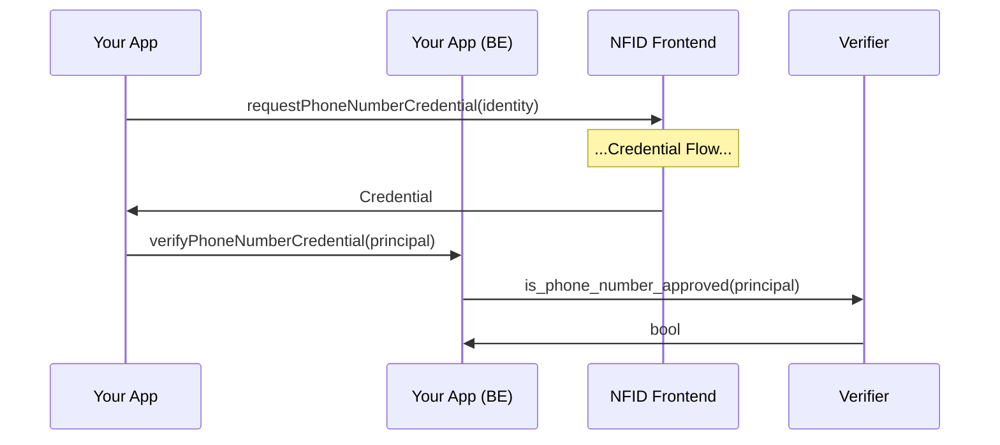

# Credentials SDK

The credentials SDK exposes typescript methods to authenticate user credentials via a window to NFID which returns zero knowledge proofs to your application.

**`requestPhoneNumberCredential (identity: DelegationIdentity, conf?: CredentialProviderConf) : Promise<CredentialResult>`**

Verify that the user has a phone number associated with their account.

**Params**

`identity: DelegationIdentity`

- The currently connected NFID identity.

`conf?: CredentialProviderConf`

- `provider?: URL` url of the credential provider, defaults to `https://nfid.one/credential`
- `windowFeatures` string or object describing the popup window for the provider

**Returns**

`CredentialResult`

- `status: "SUCCESS" | "REJECTED" | "ERROR"` indicates the result of the credential request. `SUCCESS` indicates the credential exists and you can proceed with verification. `REJECTED` indicates that the user has declined the request for a credential. `ERROR` indicates that something went wrong.
- `message?: string` In the case of a rejection or an error, additional details will be provided here.

**Note** The credential should be validated with our blackhole canister.

## Client Example

### Requesting a Credential

Requesting a phone number credential is as simple as:

```typescript
import { requestPhoneNumberCredential } from '@nfid/credentials';

const result = await requestPhoneNumberCredential();
```

### Verifying a Credential

It is possible for a bad actor to attempt to manipulate credentials, so we need a trustable method for verifying a them. This is provided by the `is_phone_number_approved` method on our blackholed "verifier" canister. Including this verification step, the complete flow would look like this:



The full interface for this method is `is_phone_number_approved(principal: string) : bool`, and the canister id on mainnet is `sgk26-7yaaa-aaaan-qaovq-cai`.

```
dfx canister --network ic call sgk26-7yaaa-aaaan-qaovq-cai is_phone_number_approved '("principal-as-string")'
```
