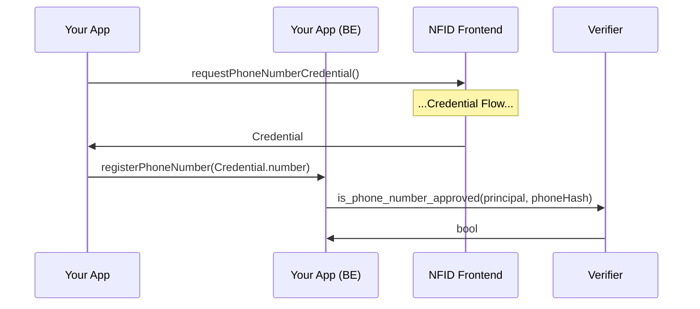

# Credentials SDK

The credentials SDK exposes typescript methods to authenticate user credentials via zero knowledge proofs. Proof calls will often open a new window to the NFID dapp, which will perform authentication and return the proof back to your application. If a verification can be performed passively, no new window may be required.

**`requestPhoneNumberCredential (conf?: CredentialProviderConf) : Promise<CredentialResult>`**

Verify that the user has a phone number associated with their account.

**Params**

`CredentialProviderConf`

-   `provider?: URL` url of the credential provider, defaults to `https://nfid.one/credential`
-   `windowFeatures` string or object describing the popup window for the provider

**Returns**

`CredentialResult`

-   `result : boolean` true if the identity has an associated phone number
-   `credential : string` a hashed phone number

**Note**

The credential should be validated with our blackhole canister.

## Client Example

Requesting a phone number credential is as simple as:

```typescript
import { requestPhoneNumberCredential } from '@nfid/credentials';

const { credential, result } = await requestPhoneNumberCredential();
```

You can alter the default window features like so:

```typescript
const { credential, result } = await requestPhoneNumberCredential({
    windowFeatures: {
        popup: false,
    },
});
// See complete list of window features: https://developer.mozilla.org/en-US/docs/Web/API/Window/open#parameters
```

### Verifying a Credential

It is possible for a bad actor to attempt to manipulate a credential, and this necessitates a trustable method for verifying a credential. This is provided by the `is_phone_number_approved` method on our blackholed "verifier" canister, which is tamper proof and keeps hashed records of all phone number credentials. With this verification step, the complete flow would look like this:



The full interface for this method is `is_phone_number_approved(principal: string, phone_hash: string) : bool`, and the canister id on mainnet is `gzqxf-kqaaa-aaaak-qakba-cai`.

```
dfx canister --network ic call gzqxf-kqaaa-aaaak-qakba-cai is_phone_number_approved '("principal-as-string", "phone-number-hash")'
```

## Provider Example

The SDK provides a hook for providers to handle credential requests, keeping the implementation details of returning data to the client out of provider implementations.

```typescript
import { registerPhoneNumberCredentialHandler } from '@nfid/credentials';

async function handler(): Promise<CredentialResult> {
    return new Promise(resolve =>
        setTimeout(() => resolve({ result: true, credential: 'abcdefg' }), 3000)
    );
}

registerPhoneNumberCredentialHandler(handler);
```
