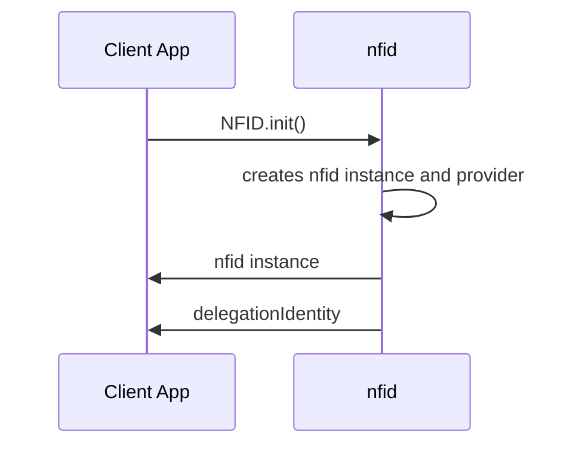

# embed

## Initialisation

```mermaid
sequenceDiagram

    participant A as Client App
    participant B as nfid

    A->>B: NFID.init()
    B->>B: creates nfid instance and provider
    B->>A: nfid instance
    B->>A: delegationIdentity
```
